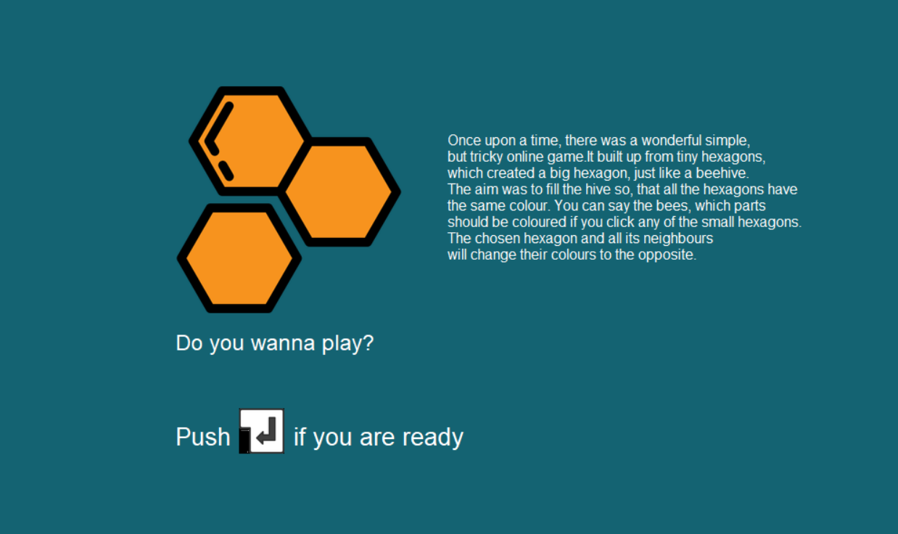
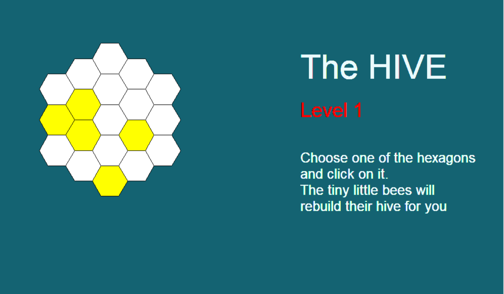

# hiveGame

This is an implementation of a game from the late 90's. The user has a board full of hexagons, which are coloured or not.
The aim is, to make every small hexagon white by clicking. Doing so, the user can enter the next level.

 
 

## Usage

## Prerequisites  
Download [Python](https://www.python.org/) and set as environment variable on your computer.
You should have a terminal with git: Git Bash or cmdr

## Running the game  
The game is runnable from Terminal:
 -  Open a terminal with git 
 -  Type: `git clone https://github.com/matheb/hiveGame.git`
 -  then `cd` to the "hiveGame" folder.
 -  Type `python hiveController.py` and it has already started.
